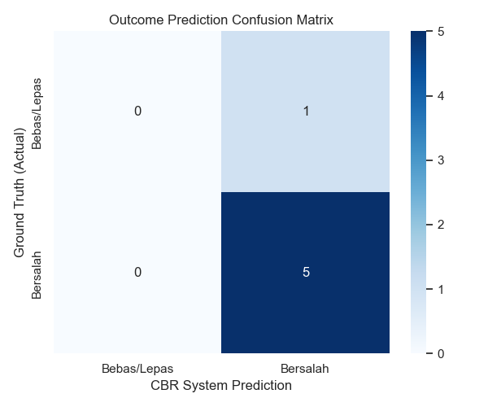
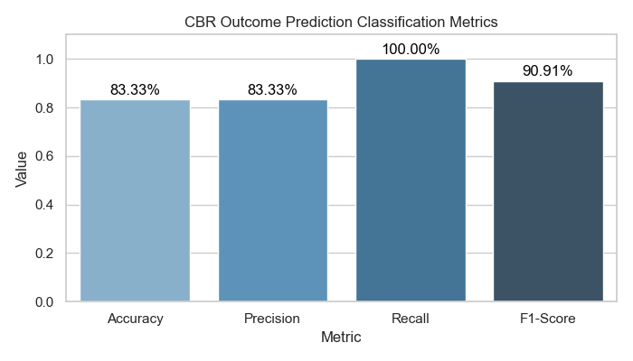
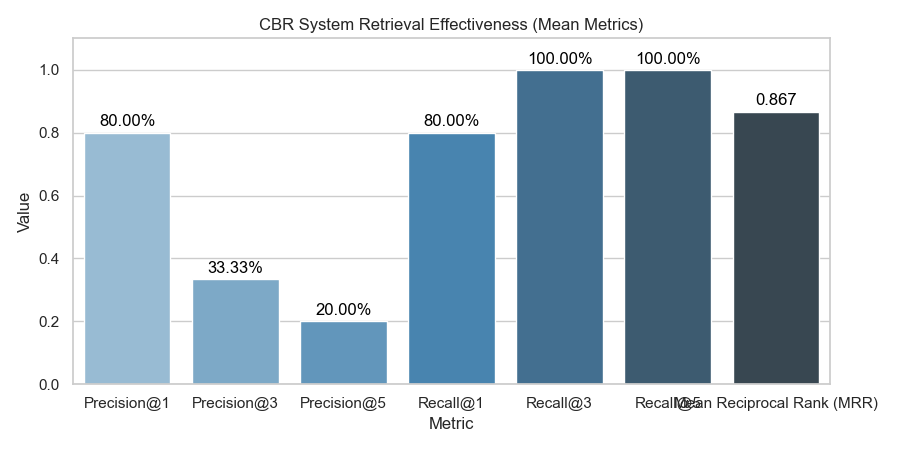

# Case-Based Reasoning (CBR) System for Document Forgery (Pemalsuan Surat) Detection

This repository implements a production-ready, modular Case-Based Reasoning (CBR) system in Python 3.11 designed to analyze and detect document forgery (*Pemalsuan Surat*) based on historical court decisions (*Putusan Pengadilan*). 

CBR systems model human reasoning by solving new legal scenarios using the solutions of similar past cases through the classic four-phase lifecycle: **Retrieve**, **Reuse**, **Revise**, and **Retain**.

---

## 📋 Table of Contents
1. [Project Description](#-project-description)
2. [Folder Explanation](#-folder-explanation)
3. [Requirements](#-requirements)
4. [Installation & Setup](#-installation--setup)
5. [Execution Order](#-execution-order)
6. [Expected Outputs](#-expected-outputs)
7. [Visualizations & Metrics](#-visualizations--metrics)
8. [GitHub Usage & Workflow](#-github-usage--workflow)

---

## 📖 Project Description

Legal document forgery cases in Indonesia typically fall under articles like **Pasal 263, 264, or 266 of the Criminal Code (KUHP)**. This CBR system extracts structured metadata from raw court ruling PDFs, represents them as historical cases in a case base, and allows legal practitioners to query new case scenarios to:
- Retrieve the Top-5 most relevant past rulings.
- Classify and predict the likely outcome (Conviction / *Bersalah* vs. Acquittal / *Bebas/Lepas*) using a similarity-weighted voting model.
- Automatically recommend legal sentencing guidelines by reusing the closest matching historical verdict.

---

## 📂 Folder Explanation

```text
├── data/
│   ├── raw_pdf/      # Original PDF documents of court decisions (e.g. case001.pdf)
│   ├── raw_text/     # Extracted, tokenized, and stemmed text files (Sastrawi output)
│   └── processed/    # Structured databases (cases.csv, cases.json) and batch predictions
├── eval/             # Evaluation metrics and generated performance plots
├── models/           # Persisted machine learning models and vectorizers (pickle format)
├── notebooks/        # Step-by-step Jupyter notebooks implementing the CBR pipeline
├── results/          # Log files and preprocessing execution reports
├── requirements.txt  # Project library dependencies
└── README.md         # Project documentation (this file)
```

| Directory | Purpose |
| :--- | :--- |
| `data/raw_pdf/` | Source PDF files downloaded from Indonesian Supreme Court database (*Direktori Putusan MA*). |
| `data/raw_text/` | Extracted and fully preprocessed text files containing stemmed tokens for TF-IDF indexing. |
| `data/processed/` | Structured unified case bases (`cases.csv`/`cases.json`) and run-time model predictions. |
| `eval/` | Performance evaluations, confusion matrices, and bar charts of prediction accuracy. |
| `models/` | Serialized model files (`svm_model.pkl` and `tfidf_vectorizer.pkl`) for retrieval execution. |
| `notebooks/` | Interactive Jupyter notebooks documenting the 5 main CBR stages. |
| `results/` | Application run logs, including `cleaning_log.log` and metadata statistics. |

---

## 🛠️ Requirements

- **Python 3.11**
- **Libraries**:
  - `pdfplumber`: Accurate and precise PDF text parsing.
  - `nltk`: Tokenization and text segmenting.
  - `Sastrawi`: Formal Indonesian language stemming and stopword removal.
  - `scikit-learn`: TF-IDF Vectorization, Cosine Similarity, SVM Classifier, and Train-Test splits.
  - `pandas` & `numpy`: Data manipulation and tabular computation.
  - `matplotlib` & `seaborn`: Confusion matrix heatmaps and evaluation plotting.

---

## 🚀 Installation & Setup

1. **Clone the Repository**:
   ```bash
   git clone https://github.com/deysenwj/CBR-PemalsuanSurat.git
   cd CBR-PemalsuanSurat
   ```

2. **Set Up a Virtual Environment (Python 3.11)**:
   ```bash
   python -m venv venv
   # On Windows (PowerShell):
   .\venv\Scripts\Activate.ps1
   # On macOS/Linux:
   source venv/bin/activate
   ```

3. **Install Dependencies**:
   ```bash
   pip install --upgrade pip
   pip install -r requirements.txt
   ```

4. **Verify Sastrawi Installation**:
   Ensure `Sastrawi` is correctly registered in the python path by launching python in the terminal and running:
   ```python
   from Sastrawi.Stemmer.StemmerFactory import StemmerFactory
   print(StemmerFactory().create_stemmer().stem("pemalsuan"))
   # Expected Output: palsu
   ```

---

## 🔄 Execution Order

To run the complete Case-Based Reasoning system, execute the Jupyter Notebooks inside the `notebooks/` directory sequentially:

1. **`01_case_base.ipynb`**
   - Extracts raw page-by-page text from PDFs.
   - Cleans watermarks, page numbers, headers, and footers.
   - Tokenizes, removes Indonesian stopwords, and performs stemming.
   - Saves output files to `data/raw_text/` and logs stats.

2. **`02_case_representation.ipynb`**
   - Parses the raw text to extract structured fields (Case ID, Defendant, Docket Number, Date, Court, Violated Articles, Facts, and Verdict).
   - Generates and exports the case base (`data/processed/cases.csv` and `data/processed/cases.json`).

3. **`03_case_retrieval.ipynb`**
   - Builds TF-IDF representations of the case texts.
   - Performs an 80:20 data split and trains an SVM classifier to predict outcomes.
   - Saves model artifacts to `models/`.
   - Implements the Cosine Similarity retrieval helper `retrieve(query, k=5)`.

4. **`04_case_reuse.ipynb`**
   - Implements similarity-weighted majority voting based on the Top-5 retrieved cases.
   - Outputs final outcome predictions and recommends adaptation verdicts.
   - Saves run results to `data/processed/predictions.csv`.

5. **`05_evaluation.ipynb`**
   - Evaluates the prediction metrics (Accuracy, Precision, Recall, F1-Score).
   - Computes retrieval effectiveness metrics ($Precision@K$, $Recall@K$, and MRR).
   - Exports visual plots and tabular results.

---

## 📦 Expected Outputs

Upon running the entire pipeline, the following key outputs will be generated:

- **`data/processed/cases.csv`**: Master case database table.
- **`data/processed/cases.json`**: Structured case database for CBR engine consumption.
- **`data/processed/predictions.csv`**: Batch scenario predictions.
- **`models/svm_model.pkl`**: Serialized classifier.
- **`models/tfidf_vectorizer.pkl`**: Serialized retrieval indexer.
- **`eval/prediction_metrics.csv`**: Classification evaluation values.
- **`eval/retrieval_metrics.csv`**: Search/retrieval evaluation metrics.
- **`eval/confusion_matrix.png`**: Heatmap of actual vs. predicted verdicts.
- **`eval/prediction_metrics_chart.png`**: Bar plot of classification scores.
- **`eval/retrieval_metrics_chart.png`**: Bar plot of search scores.
- **`results/cleaning_log.log`**: Standard run logs.
- **`results/cleaning_log.json`**: Extraction audit logs.

---

## 📊 Visualizations & Metrics

### 1. Confusion Matrix (Prediction Performance)


### 2. Prediction Classification Metrics


### 3. Retrieval Effectiveness Chart


---

## 🐙 GitHub Usage & Workflow

Ensure clean repository maintenance by following these guidelines:

1. **Ignore Large/Binary Files**:
   Ensure virtual environments (`venv/`), temporary local configuration directories (`.ipynb_checkpoints/`, `__pycache__/`), and scratch files are kept out of Git versioning.
   
2. **Branching Strategy**:
   - Keep `main` for clean, fully tested, and stable notebook builds.
   - Work on features using descriptive branch names (e.g. `feat/preprocessing`, `feat/retrieval`).

3. **Commits**:
   Commit regularly with clean, explicit messages:
   ```bash
   git add .
   git commit -m "feat: implement weighted majority voting reuse in notebook 04"
   git push origin main
   ```
